# Lochraster Prototyping Boards

Professionelle Lochraster-Platinen (Perfboards) im 2.54mm Raster, optimiert fuer die Fertigung bei JLCPCB (1-2 Layer). Alle Boards verfuegen ueber integrierte GND/VCC-Versorgungsschienen mit Kupferzonen auf beiden Lagen.

## Board-Varianten

### Groessen
| Groesse | Raster | Bemerkung |
|---------|--------|-----------|
| 50 x 70 mm | 2.54 mm | Kompakte Projekte |
| 70 x 100 mm | 2.54 mm | Standardgroesse |
| 100 x 160 mm | 2.54 mm | Europaformat |

### Muster-Typen

<table>
<tr>
<th>Unverbunden</th>
<th>Streifenraster</th>
<th>3er-Gruppen</th>
<th>Steckbrett</th>
</tr>
<tr>
<td>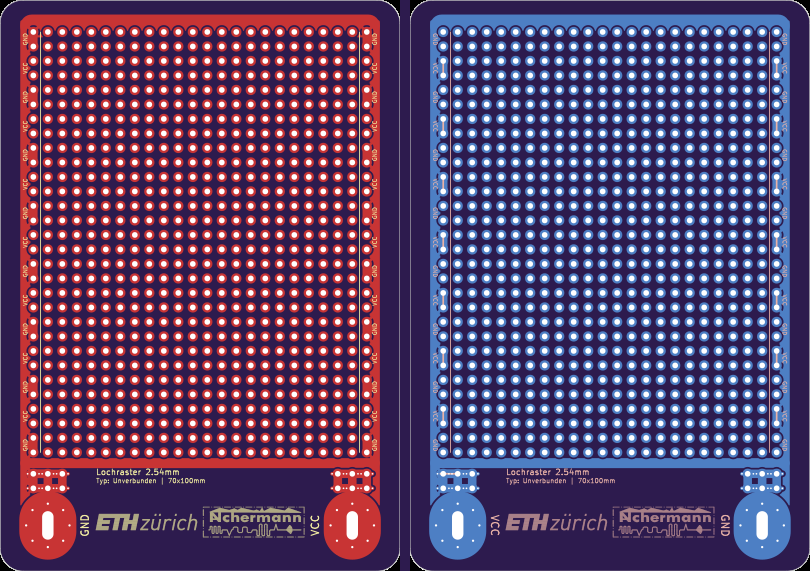</td>
<td>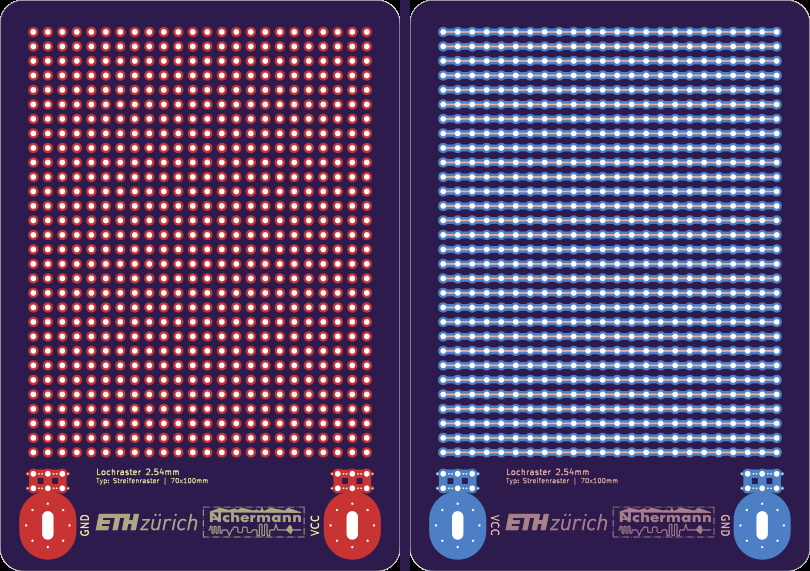</td>
<td>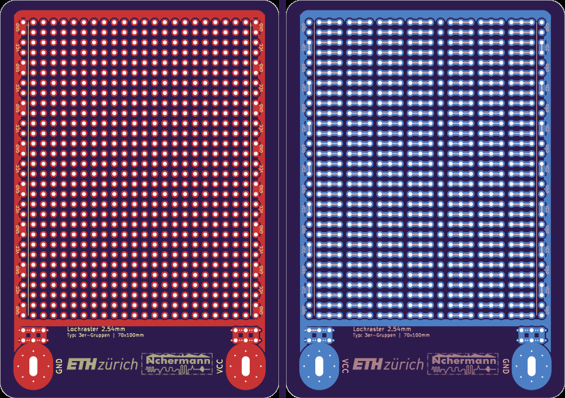</td>
<td>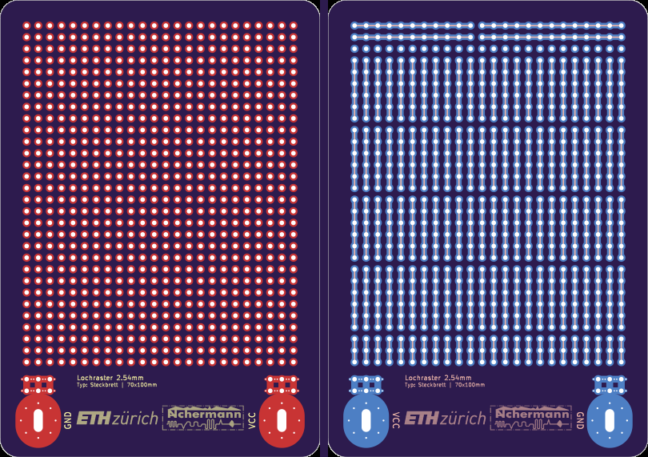</td>
</tr>
<tr>
<td>Einzelne Pads ohne Verbindung — maximale Flexibilitaet</td>
<td>Durchgehende Kupferstreifen (Veroboard-Stil)</td>
<td>Je 3 Pads verbunden — ideal fuer SOT-23, Widerstaende</td>
<td>Steckbrett-Layout mit Versorgungsschienen</td>
</tr>
</table>

### Alle Varianten

<table>
<tr style="background-color:#4a2066;">
<th></th>
<th>50 x 70 mm</th>
<th>70 x 100 mm</th>
<th>100 x 160 mm</th>
</tr>
<tr style="background-color:#4a2066;">
<td><b>Unverbunden</b></td>
<td>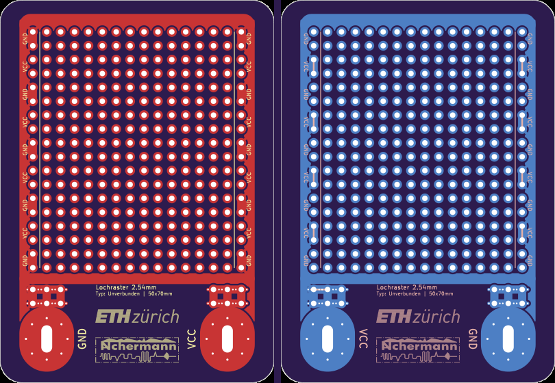</td>
<td></td>
<td>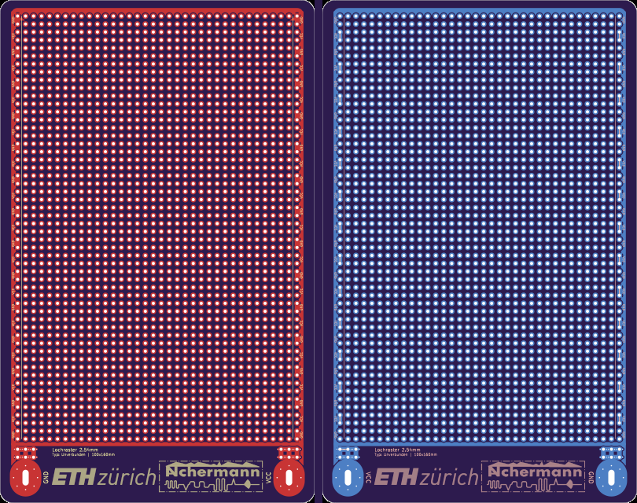</td>
</tr>
<tr style="background-color:#4a2066;">
<td><b>Streifenraster</b></td>
<td>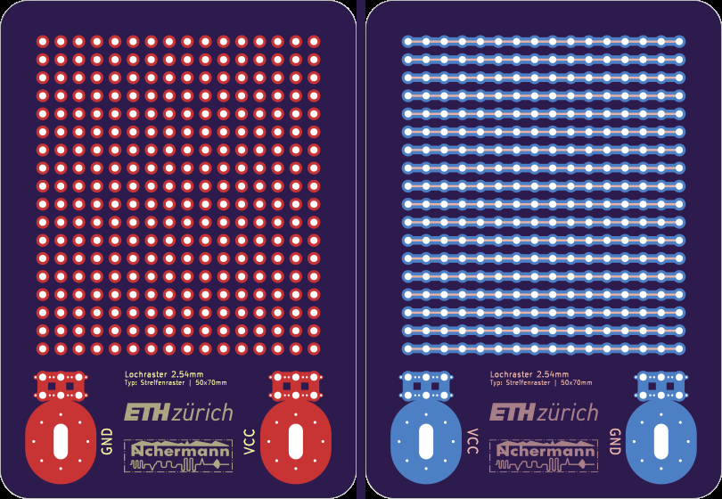</td>
<td></td>
<td>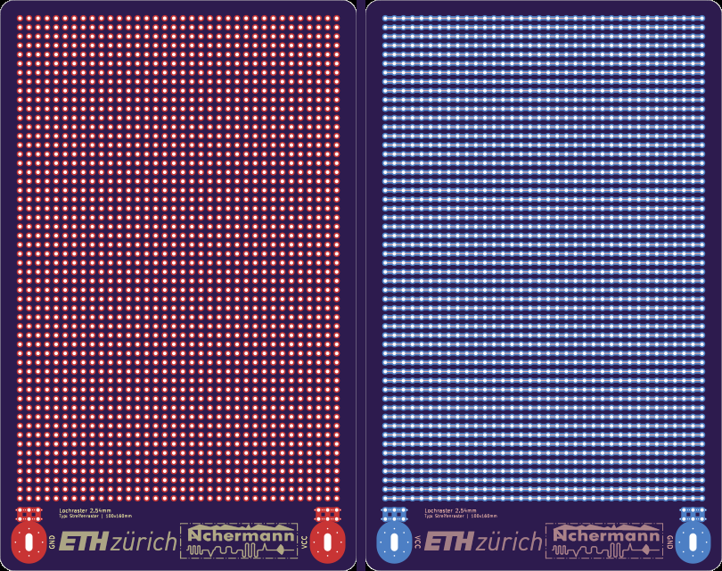</td>
</tr>
<tr style="background-color:#4a2066;">
<td><b>3er-Gruppen</b></td>
<td>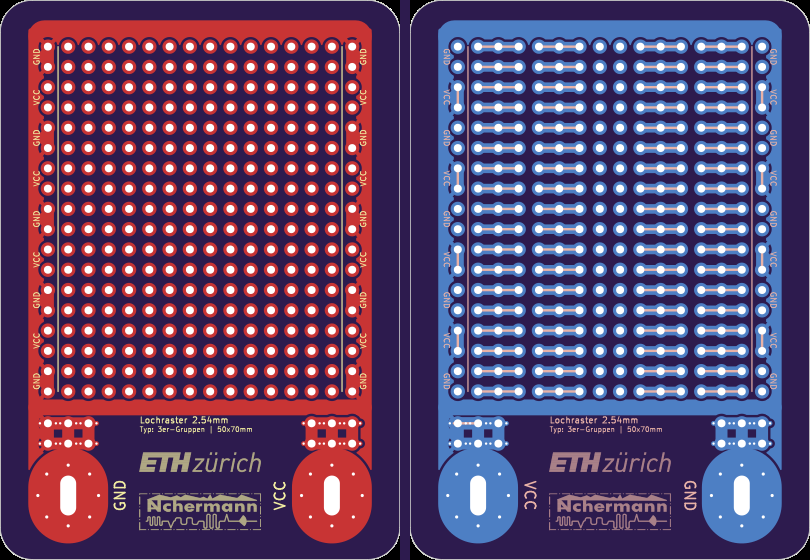</td>
<td></td>
<td>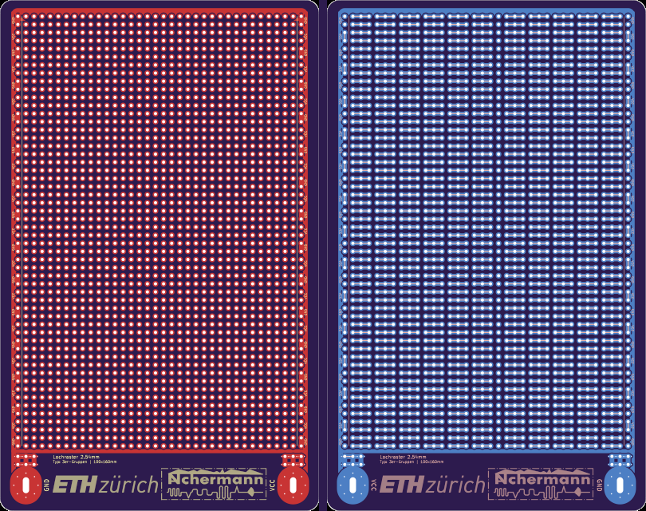</td>
</tr>
<tr style="background-color:#4a2066;">
<td><b>Steckbrett</b></td>
<td>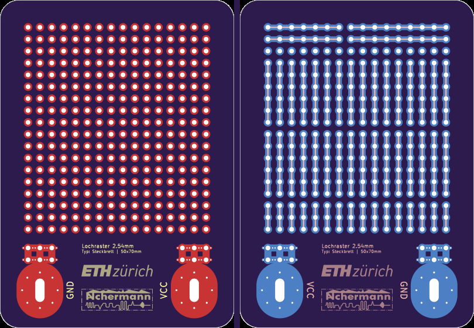</td>
<td></td>
<td>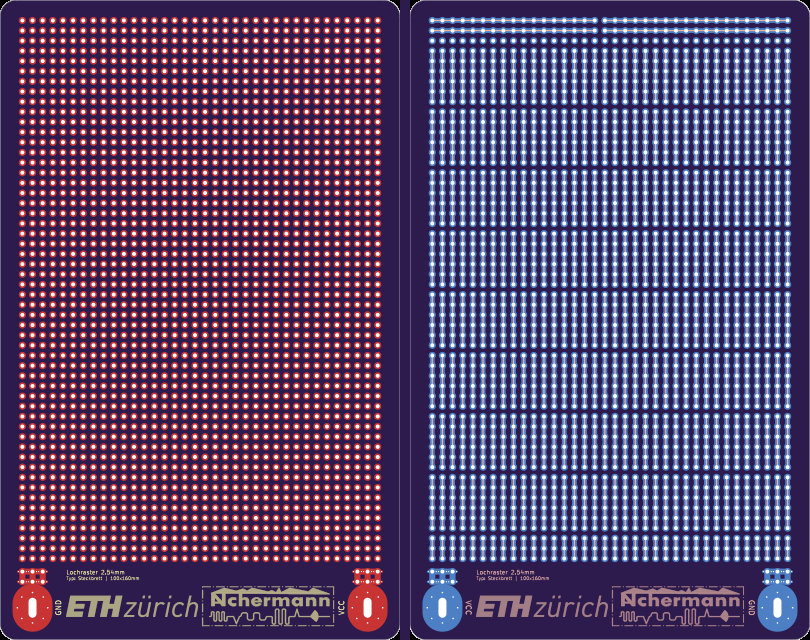</td>
</tr>
</table>

## Features

- **2.54mm Raster** — kompatibel mit allen gaengigen THT-Bauteilen
- **GND/VCC Versorgungsschienen** — abwechselnde 2er-Gruppen an beiden Aussenkanten (Unverbunden & 3er-Gruppen Varianten)
- **Kupferzonen auf beiden Lagen** — GND-Plane auf F.Cu, VCC-Plane auf B.Cu, umlaufend verbunden (Top, Seiten, Bottom)
- **Grosse Anschlusspads** — ovale Durchkontaktierungen mit Microvia-Ring fuer niederohmige Stromversorgung
- **Doppelseitige Beschriftung** — GND/VCC Markierungen auf Vorder- und Rueckseite
- **Abgerundete Ecken** — 4mm Radius, professionelles Erscheinungsbild
- **JLCPCB-optimiert** — alle Design Rules fuer guenstige Fertigung eingehalten

## Projektstruktur

```
Projekt/
├── README.md
├── lochraster_real_size.pdf          # 1:1 Druckvorlage aller Boards (A4)
├── production_zips/                  # Fertige Gerber-ZIPs fuer JLCPCB-Bestellung
│   └── proto_{groesse}_{typ}_JLCPCB.zip
├── images/                           # Board-Vorschaubilder
├── Software/
│   └── generate_lochraster.py        # Generator-Skript
└── Hardware/
    ├── Layouts/                      # KiCad PCB-Dateien
    │   └── Laborkarte_{groesse}_{typ}/
    │       └── proto_{groesse}_{typ}.kicad_pcb
    └── Gerbers/                      # Fertigungsdaten
        └── Laborkarte_{groesse}_{typ}/
```

## Fertigung bestellen

1. Gewuenschte ZIP-Datei aus `production_zips/` herunterladen
2. Auf [jlcpcb.com](https://jlcpcb.com) hochladen
3. Einstellungen:
   - **Layers:** 2
   - **PCB Thickness:** 1.6mm
   - **Surface Finish:** HASL (oder ENIG)
   - **Copper Weight:** 1oz
   - Restliche Einstellungen: Standard

## Boards neu generieren

```bash
# Alle 12 Board-Varianten generieren
python generate_lochraster.py

# Kupferzonen fuellen (benoetigt KiCad Python)
"C:\Program Files\KiCad\9.0\bin\python.exe" fill_zones.py

# 1:1 PDF erzeugen
python make_pdf.py
```

### Abhaengigkeiten

- Python 3.10+
- KiCad 9.0 (fuer Zone-Filling und Gerber-Export)
- Pillow (`pip install Pillow`)
- ReportLab (`pip install reportlab`) — fuer PDF-Erzeugung
- CairoSVG (`pip install cairosvg`) — fuer PNG-Vorschaubilder

## Lizenz

Siehe [LICENSE](../LICENSE) im Root-Verzeichnis.
